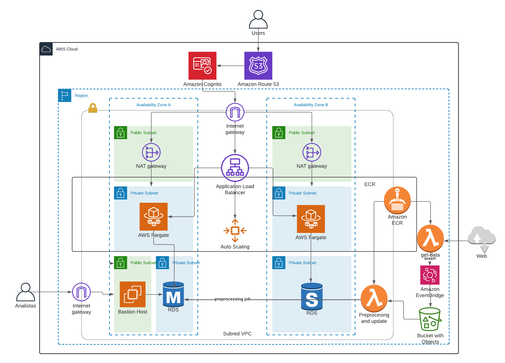

# :rocket: CDE - TP módulo 1

## :clipboard: Overview 
El objetivo es plantear la arquitectura de un aplicacion basada en un sistema de informacion geográfica (GIS), para explorar espacialmente distintas metricas, lo que permitirá un mayor conocimiento del comportamiento geográfico y ademas será una herramienta para definiciones comerciales.

:one: Función Lambda obtiene los datos de la web y la aloja en un bucket de S3 en formato parquet y me informa via email el exito del proceso \
:two: La función Lambda preprocesa los datos crudos, realiza tranformaciones y calcula métricas que son ingestadas en la BD RDS. \
:three: Ejecutamos una tarea en ECS Fargate para levantar la app docketizada. \
:four: front-end de la aplicación para acceso a los usuarios

## :mega: Arquitectura 

Mi objetivo era alojar de forma privada la aplicación en un contenedor Docker utilizando  Amazon ECS con un tipo de lanzamiento de AWS Fargate, detrás de un Application Load Balancer, y acceder a la aplicación con AWS NAT Gateway. Utilizo Amazon RDS para alojar la base de datos relacional MySql para la aplicación que se ejecuta en Amazon ECS con alta disponibilidad.

## :mega: Networking 

Dentro de la región definimos dos Availability Zones (AZ), en cada una de ellas dentro de la VPC, creamos una subnet pública y dos subnets privadas.

## :mega: Diagrama de Arquitectura

## :mega: Servicios AWS utilizados

* S3
* RDS: Base de datos relacional MySql
* Lambda functions
* EventBridge
* SNS
* EC2
* ECR - Elastic Container Registry: Alojar las imagenes que forman las Lambdas y la app
* ECS - Elastic Container Service
* AWS Fargate
* Load Balancer
* Auto Scalling
* CloudWatch
* Cognito
* Route53: El Lab no cuenta con permisos para registrar dominio.

## :checkered_flag: Steps 

1. Creación de VPC
2. Creación de 2 subnets publicas y 4 privadas distribuidas en dos Availability Zones
3. Creo un bucket S3 y una instancia en Base de Datos RDS MySQL, adicionando un bastion host para acceder a la BD
4. Upload de imagenes de Docker a ECR
5. Genero Función Lambda para hacer unrequest sobre la Web Properati y parquetizar los datos en S3
6. Creación de Event Bridge para cronear la lambda generada en el paso anterior para que obtenga los datos el primer dia de cada mes
7. Genero la segunda Lambda que preprocesa la data, calculando las metricas necesarias y alojo los datos en BD, el exito de la función es notificado por email via SNS
8. Creación de cluster en ECS para iniciar el servicio de la app
9. Creacion de Application Load Balancer interno, configuracion de security groups y target groups
10. Creo el NAT Gateway que es una regla para las rutas de la subnet privada sobre la que se encuentra el ECS
12. Defino las Task para la ejecución de contenedores
12. Creo un servicio sobre la tarea definida en el paso anterior mediante el clúster ECS con FARGATE como tipo de lanzamiento.
13. Configuramos el Application Load Balancer y el auto scalling al servicio
14. Agregue dos métricas de Cloudwatch a modo de alarma para el Auto Scalling trackeando la utilización de CPU y otra para el gasto diario notificando por SNS al superar el umbral. 
15. Administramos los usuarios con Cognito (entiendo que el Lab si bien pude generar un grupo de usuarios no me permitió incorporarlo al ALB)
16. No cuento con permsios para crear un host en Route53, pero hago mención para tener un DNS propio de la app

## :money_with_wings: Costos

me fue dificil estimar los costos por desconocimiento de como se calculan y en que los mismos son variables. De todas manesras basandomes en algunos supuestos de uso habitual que podríamos tener, realicé estimaciones de costos mensuales de los que creo que son los servicios incluidos mas representativos en materia de costos.

Los costos fueron calculados mediante [AWS Pricing calculator](https://calculator.aws/#/addService)

- RDS Database: db.t3.micro - vCPU: 2 Memory: 1 GiB with Storage 20GiB: 17 USD
- Fargate cost (monthly): 48.05 USD
    - 60.83 tasks x 2 vCPU x 8 hours x 0.04048 USD per hour = 39.40 USD for vCPU hours
    - 60.83 tasks x 4.00 GB x 8 hours x 0.004445 USD per GB per hour = 8.65 USD for GB hours
- Application Load Balancer fixed hourly charges (monthly): 16.43 USD

## :round_pushpin: Conclusion

Me gusto mucho hacer el TP, le dedique bastante tiempo, tuve muchas situaciones de prueba y error, que me permitieron aprender y entender muchos aspectos de la arquitectura cloud y su funcionamiento. Me respalde mucho en la Documentación de AWS que es muy amplia y en la comunidad global que tiene que me aportaron ideas para solucionar algunos de los problemas que tuve en el desarrollo del TP.

## :construction: Next Steps

Menciono algunos puntos que tenía en mente considerar, pero para definirle un marco al TP no fueron incluidas

- Incorporar API Gateway en la que haciendo un requerimiento con el tipo de propiedad, habitaciones, ubicación geográfica, devuelva el posible precio de la propiedad con información geografica o creando un Model Endpoint
- Definir y aplicar un criterio de cantidad de historia a mantener en la BD y en los buckets de S3
- Agregar condiciones de inicio y shutdown del servicio ECS para ser eficiente en los costos
- Analizar y aplicar criterios de eficiencia de costos